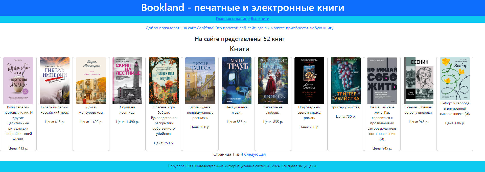
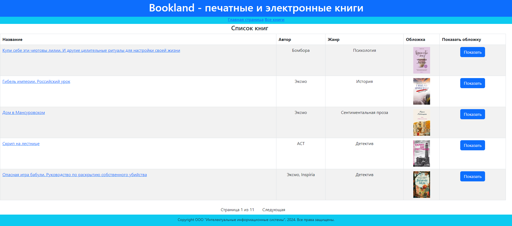
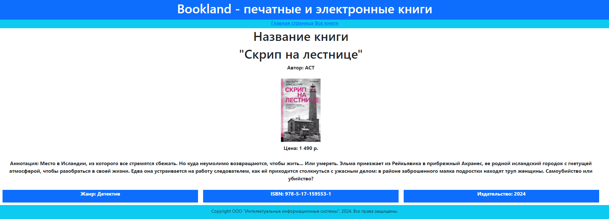

# Web_FastAPI_project
Этот проект представляет собой веб-приложение, разработанное с использованием фреймворка FastAPI (Python).

## Содержание
- [Описание](#описание)
- [Главная страница](#главная-страница-)
- [Страница со списком книг](#страница-со-списком-книг)
- [Страница с подробной информации о книге](#страница-с-подробной-информации-о-книге)
- [Установка репозитория](#установка-репозитория)

## Описание
Веб-приложение представляет собой онлайн-магазин электронных книг _'Bookland'_. Он включает в себя: 
- Главную страницу;
- Страницу со списком книг;
- Подробную информацию по каждой книге.

Сайт оптимизирован для мобильных устройств и настольных компьютеров.

### Главная страница 
Представляет собой информацию о всех книгах на сайте  - это небольшие окошки с изображением обложек, 
названия и цены. Отсюда есть ссылка страницу со списком книг под названием "Все книги"


### Страница со списком книг

Представляет собой таблицу книг со следующими колонками: 
- Название книги;
- Автор; 
- Жанр; 
- Обложка; 
- Показать обложку.

Название книги является ссылкой на страницу с более подробной информацией о книге. 
Также есть поддержка пагинации страницы.


### Страница с подробной информации о книге
Страница имеют всю основную информации о книге. 
Помимо названия, автора и жанра и обложки есть следующая информация: 
- Аннотация книги; 
- Регистрационный номер ISBN;
- Издательство.

Есть возможность при нажатии на изображение обложки открыть в отдельном окне для детального просмотра.


## Установка репозитория
1. Клонируйте репозиторий:
```bash
git clone https://github.com/SpektR632/Web_FastAPI_project.git
```
2. Откройте проект в предпочитаемом редакторе;
3. Установите зависимости из файла requirements.txt;
4. Запустите локальный сервер для просмотра сайта. Пример запуска: 

```uvicorn app:app```
